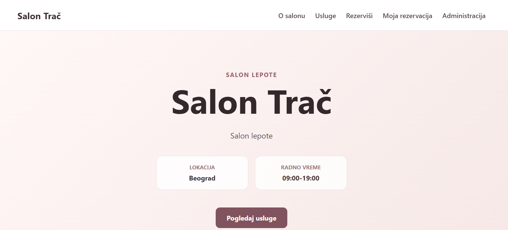
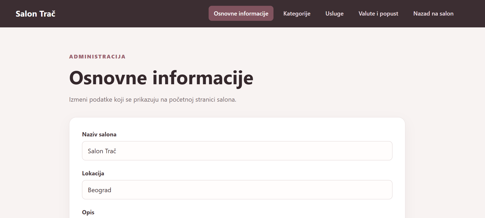
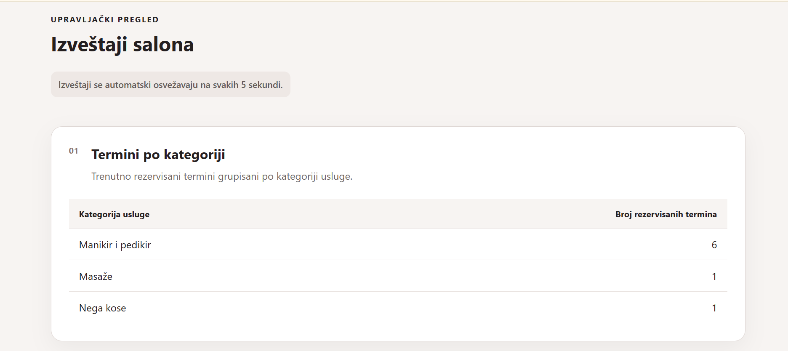

# Salon Trač – Full-Stack Reservation System

Salon Trač is a full-stack web application developed as a university project for managing reservations in a beauty salon.

The system allows users to browse available services and time slots, create and manage reservations, apply promotional codes, and select a preferred currency. Reservation-related events are processed asynchronously and used by a separate reporting component.

The project was developed as a two-person team project.





## Features

* Browse available salon services and categories
* View available appointment slots
* Create reservations containing one or more services
* Add additional services to an existing reservation
* Cancel reservations
* Apply promotional codes and calculate discounts
* Support for multiple currencies using an external exchange-rate API
* Generate reservation access codes and new promotional codes
* Cache selected data using Redis
* Asynchronous reservation processing using RabbitMQ
* Event-based synchronization with a reporting subsystem
* Reporting dashboard for reservation statistics
* Idempotent event processing to prevent duplicate event handling

## Technologies

### Frontend

* React
* TypeScript
* Vite

### Backend

* C#
* ASP.NET Core Web API
* .NET Worker Service
* Entity Framework Core

### Data & Infrastructure

* MariaDB
* Redis
* RabbitMQ

### External Services

* Frankfurter API for currency exchange rates

## Architecture

The application is divided into several components with clearly separated responsibilities.

### Main Reservation System

The main application handles salon services, available appointments, pricing, promotional codes, and reservation management.

The backend follows a layered structure with separate domain and infrastructure components.

Main backend projects include:

* `Salon.Api` – REST API and application services
* `Salon.Domen` – domain entities and business models
* `Salon.Infrastruktura` – database access and infrastructure services
* `Salon.Radnik` – background worker for asynchronous processing
* `Zajednicko.Poruke` – shared event/message definitions

### Reporting System

The reporting subsystem receives reservation events and maintains data used for generating reports.

It consists of:

* `Izvestavanje.Api`
* `izvestavanje-web`

### Frontend Applications

* `salon-web` – main customer-facing reservation application
* `izvestavanje-web` – reporting dashboard

## Asynchronous Processing

RabbitMQ is used for asynchronous communication between system components.

When reservation-related changes occur, the application publishes events such as:

* reservation created
* reservation updated
* reservation cancelled

A background component processes these events and synchronizes the reporting data.

Event processing is implemented with idempotency in mind, preventing the same event from being processed more than once.

## Caching

Redis is used as a caching layer to reduce unnecessary database access and improve access to frequently requested data.

## Reservation Flow

A typical reservation process includes:

1. Selecting a service
2. Selecting a date
3. Loading available appointment slots
4. Selecting an appointment
5. Optionally adding additional services
6. Applying a promotional code
7. Selecting a currency
8. Providing an email address
9. Creating the reservation
10. Publishing reservation events for asynchronous processing

After a successful reservation, the system generates an access code and a new promotional code.

## Project Structure

```text
src/
│
├── Salon.Api
├── Salon.Domen
├── Salon.Infrastruktura
├── Salon.Radnik
├── Zajednicko.Poruke
│
├── salon-web
│
├── Izvestavanje.Api
└── izvestavanje-web
```

## Running the Project Locally

### Prerequisites

Make sure the following are installed and running:

* .NET
* Node.js and npm
* MariaDB
* Redis
* RabbitMQ

### Backend

Configure the required database, Redis, and RabbitMQ connection settings before starting the application.

Run the main API:

```bash
dotnet run --project src/Salon.Api
```

Run the background worker:

```bash
dotnet run --project src/Salon.Radnik
```

If using the reporting subsystem, start its API as well.

### Frontend

Navigate to the main frontend application:

```bash
cd src/salon-web
npm install
npm run dev
```

For the reporting application:

```bash
cd src/izvestavanje-web
npm install
npm run dev
```

## Team

Developed by:

* Tamara Jerotijević
* Jovana Dumić

University project developed at the Faculty of Organizational Sciences, University of Belgrade.

## Academic Context

The project was developed as part of the **Implementation of Information Systems** course and focuses on applying concepts such as:

* layered application architecture
* REST APIs
* relational database persistence
* caching
* message queues
* asynchronous processing
* event-driven communication
* idempotent event handling
* integration between multiple application components
